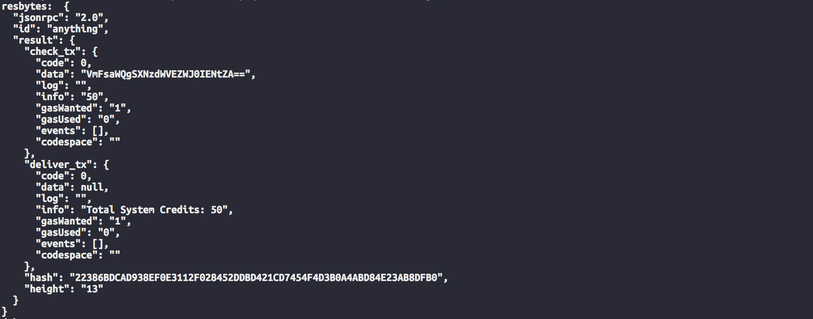
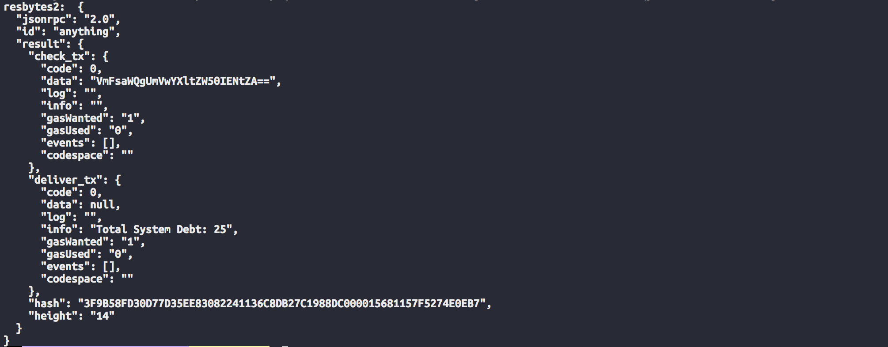

# Debtchain

## Introduction

This is the companion repo to the short paper "Debt representation in UTXO blockchains" and contains a prototype of a UTXO-based blockchain capable of debt representation with an application to reverse mortgages. 

The first screenshot illustrates the simplicity with which the total amount of credit in the system can be queried. The result JSON object contains two JSON objects which are the results of calling `CheckTx` and `DeliverTx`, respectively. 

In a similar manner, the second screenshot illustrates the simplicity with which the total amount of debt can be queried. Note that in the second screenshot, a repayment of 25 has been repaid to some lender. The UTXO model enables transaction level privacy protections for individuals while retaining system-level transparency.

## Gotchas

1. Wait until the node has run for a few seconds before sending requests. If the requests don't seem to work try running the client executable again.

## Scripts

- `clearAndInit.sh` clears Tendermint data directories and resets the instance. It also resets the database directories. It is recommended to use this to help with and to reduce bugs and other errors.

- `startNode.sh` starts the Tendermint node with the Home Equity Application

## Build Instructions

`make` will build the node and the client executables. Note that it is recommended to build the client in the `cmd/client` folder separately to avoid rebuilding all executables when this is not necessary.

## Run

1. `startNode.sh` to start the node representing the backend 
2. (after building the client executable) run the client ./client

